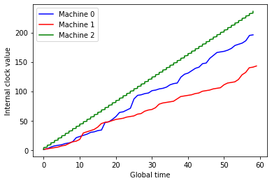
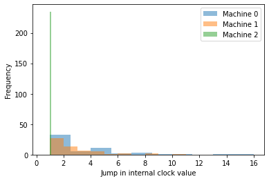

# Design Notebook

Authors: Prayaag Venkat and Hugh Zhang

## Overview of design

At a high level, our application instantiates three separate Processes (using Python's multiprocessing package), each corresponding to one of the virtual machines. The machines are identical, except for having different identifiers, and execute the following functionality:
- Maintain a queue of pending events.
- Maintain a clock (int) that stores the current internal timestep of the machine.
- Write events to a machine-specific log as specified below.
- Bind to a socket, reserved for this machine, and listen for incoming messages, which are added to the queue.
- Execute at most a pre-specified number of the following instructions per second. Each instruction is executed and then is written to a log. If the queue is empty, one of the remaining instructions is chosen (with pre-specified probabilities). After each instruction, the internal clock is incremented by 1.
    - Pop an event (i.e. incoming message) off the queue.
    - Send a message (over appropriate socket) to one of the other two machines.
    - Send a message to both of the other two machines.
    - Internal event.

### Specific design choices

- As specified in the project description, we use sockets to implement communication between the different virtual machines. Each virtual machine plays both the role of a "server" (i.e. listen and receive messages) and a "client" (i.e. send messages to other machines). To handle concurrent communications between the three machines, we use a non-blocking socket (as opposed to multithreading). This choice is partially inspired by the Design Exercise 1, in which we made a similar choice. 
- Another design choice we made was to run each virtual machine as a separate Process, using Python's multiprocessing package. To model the fact that separate machines do not share memory, we used Processes instead of Threads (which do share memory).
- To maintain the internal logical clocks, we used Lamport's timestamp algorithm. We chose this algorithm because it is simple (each machine just maintains a single clock value), but still allows to infer some information about the ordering of events from the logs.  We update the internal clocks according to the following rules:
    - The clock is incremented before executing any instruction (listed above).
    - Any messages sent by a machine include the clock value of that machine.
    - Having received a message from another machine, which includes a clock value, the clock value on the current machine is updated to be the maximum of itself and the received clock value.
- As specified in the project description, each machine is assigned a (random) clock speed during initialization. Each machine ensures that it does not execute more number of operations per second than the clock speed it is assigned. By varying the clock speeds, we can make the scale model display interesting behavior (see discussion below). 

## Observations and Reflections

### Examination of logs

First, we ran the scale model 5 times for one minute each time. Examining the logs, we made the following observations:
- The size of jumps in the values of the logical clocks depend on the clock speeds. Generally speaking, the machines with faster clocks have smaller jump sizes, whereas the machines with slower clocks have larger jump sizes. When all machines have roughly similar clock speed, the jumps for all machines are small and similar in size. This is to be expected; faster machines will send more messages and update their clocks more frequently, causing jumps in the clocks of slower machines.
- We observed drift between logical clock values across the different machines by comparing the global time at which different machines reached a given clock value. Unsurprisingly, larger discrepancy in clock speeds leads to larger drift. When the clock speeds were roughly the same, we did observe temporary drift, but this drift tended to revert back to zero over time. On the other hand, when there was a large discrepancy between the clock speeds, the drift was apparent from the beginning and continued to increase over time.
- The queue sizes also depend in the way one would expect on the clock speeds. Faster machines will tend to have very small queue sizes, whereas slow machines tend to have larger queue sizes. This effect is more prominent when there is a significant discrepancy between the different clock speeds. Faster machines will empty the queue faster and fill up the queues of slower machines.

### Example data

As an example, we ran the scale model with the following settings:
- Machine speeds 1, 1, 4
- Duration of simulation was 60 seconds
- Probability of internal event was 0.4.

### Varying the parameters

Next, we ran the scale model for different settings of the following parameters:
- Variation in the clock cycles
- Probability of an event being internal

We found that:
- Smaller variation in clock cycles naturally resulted in less drift and smaller jumps in clock values. AS expected, queue sizes will still be large if there is also a smaller probability of an event being internal. 
- Smaller probability of an event being internal significantly exacerbated the effects described above. Namely, we observed significantly larger jumps in values of logical clock valuues, larger queue sizes and larger drift, for slower machines. This makes sense; smaller probability of internal events means more messages are sent.

One of the main takeaways from this exercise is the effect of differing machine speeds on the performance of a distributed systems. Larger discrepancy in machine speeds and more frequent communication between machines can lead to significant degradation that takes the system from being ''synchronized'' to nearly ''asynchronous''. While the results of this exercise are not surprising, the scale model clearly illustrates how changing various underlying properties of the components of a distributed system influences the overall behavior and performance of the system as a whole.

